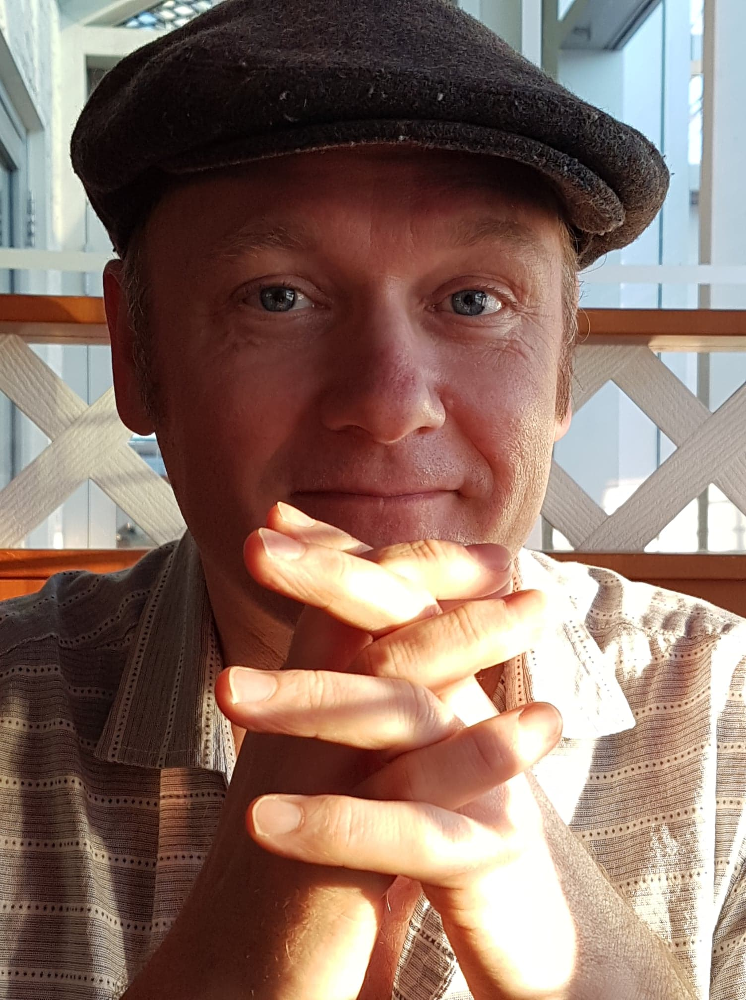

<style type="text/css">

h1.title {
  display: none;
}
</style>

```{r load_packages, message=FALSE, warning=FALSE, include=FALSE} 
library(fontawesome)
```

<br>



<big>

# Sky Onosson, Ph.D. [`r fa("envelope", fill="steelblue")`](mailto:sky@onosson.com) 

This site contains information on my research & work as a linguist. I am currently a postdoctoral researcher, some-times sessional lecturer, and active job applicant open to interesting opportunities of all kinds.

If you'd like to get in touch with me, the best way is by email at sky@onosson.com. 

**Institutional Address and Email** <br>
Department of Linguistics <br>
University of Manitoba <br>
534 Fletcher Argue Building <br>
15 Chancellor's Circle <br>
Winnipeg MB Canada  R3T 5V5 <br>

Sky.Onosson@umanitoba.ca

ORCID: [0000-0001-9308-7202](https://orcid.org/0000-0001-9308-7202){target="_blank"}

---

On this page:

* [My work in linguistics](#work)
* [My research projects](#projects)
* [My CV](#cv)


---


## My work in linguistics [`r fa("github", fill="steelblue")`](https://github.com/onosson){target="_blank"} [`r fa("file-alt", fill="steelblue")`](pdf/OnossonCV.pdf){target="_blank"} {#work}

My research revolves around the fields of phonetics, phonology, sociolinguistics, and computational linguistics. A lot of my work has looked at the temporal/dynamic properties of vowel production, such as diphthongs, from both phonological and phonetic points of view.

I am currently working as a Postdoctoral Research Fellow in the [Department of Linguistics](https://umanitoba.ca/linguistics/){target="_blank"} at the [University of Manitoba](https://www.umanitoba.ca/){target="_blank"} as part of the [*Languages in the Prairies Project*](https://home.cc.umanitoba.ca/~rosenn/sace.html){target="_blank"} spearheaded by [Dr. Nicole Rosen](https://home.cc.umanitoba.ca/~rosenn/){target="_blank"} (see below).

I am a graduate of both the [University of Manitoba](http://www.umanitoba.ca/linguistics/){target="_blank"} (B.A. and M.A.) and the [University of Victoria](https://www.uvic.ca/humanities/linguistics/){target="_blank"} (Ph.D.).

My academic work and research experience includes teaching courses in Linguistics at the [University of Manitoba](http://www.umanitoba.ca/linguistics/){target="_blank"} and the [University of Winnipeg](https://www.uwinnipeg.ca/interdisciplinary-linguistics/index.html){target="_blank"}, serving as a research assistant and lab instructor at the [University of Victoria](https://www.uvic.ca/humanities/linguistics/){target="_blank"}, presenting at a variety of major linguistics conferences, and volunteering as editor and conference organizer on multiple occasions. 

[My academic CV](pdf/OnossonCV.pdf){target="_blank"} contains much more information on all of the above. I also have an [industry-facing resume](pdf/OnossonResume.pdf){target="_blank"} for non-academic purposes, should they arise.

The information on this page is the best compendium of my research, both active and historical, but there are also a few sites which I maintain for other purposes:

* My profile on [GitHub](https://github.com/onosson){target="_blank"}
* My [ResearchGate](https://www.researchgate.net/profile/Sky_Onosson){target="_blank"} page also hosts copies of my papers & presentations, but isn't updated as often
* I also try to keep [LinkedIn](https://www.linkedin.com/in/sky-onosson-57902870/){target="_blank"} updated, although probably less diligently

---

## Research projects [`r fa("file-alt", fill="steelblue")`](pdf/OnossonCV.pdf){target="_blank"} {#projects}

I am currently involved in several active research projects which include, in no particular order:

* **Vowel dynamics.** This work stems from my [M.A.](pdf/Onosson%20-%202010%20-%20MA%20Thesis.pdf){target="_blank"} and [Ph.D.](pdf/Onosson%20-%202018%20-%20PhD%20Dissertation.pdf){target="_blank"} graduate work, which focused on "Canadian Raising" of the /aj/ and /aw/ diphthongs before voiceless codas. I am interested in the ways that different dialects handle pre-voiceless shortening phonologically, and how this plays out phonetically in the context of what are perceived as "raised" diphthongal nuclei. I have also been expanding my work on diphthongs and diphthongal productions into non-IndoEuropean languages such as *Media Lengua* (Ecuador) and *Hul'q'umi'num'* (British Columbia) -- see below.

* **Ethnoloinguistic variation in *Manitoba/Prairie English*.** The data for this research is drawn from [Dr. Nicole Rosen's](https://home.cc.umanitoba.ca/~rosenn/){target="_blank"} Canada Research Chair-funded [*Languages in the Prairies Project*](https://home.cc.umanitoba.ca/~rosenn/sace.html){target="_blank"} (LIPP). Significant findings from this research include the documentation of distinctive ethnolinguistic patterns across several phonological processes in the Filipino and Mennonite communities in Manitoba, and documentation of both Canadian Shift and prevelar raising in general Manitoba/Prairie English. My research on LIPP has led to two [conference presentations](pdf/Onosson,%20Rosen%20-%202020%20-%20American%20Dialect%20Society.pdf){target="_blank"}, including a [published proceedings](pdf/Onosson,%20Rosen,%20Li%20-%202019%20-%20ICPhS%20Proceedings.pdf){target="_blank"}, and a full article is currently under peer review. 

* **Variation and change in contemporary *Brazilian Portuguese*.** Beginning in 2015, in collaboration with [Christiani Pinheiro Thompson](https://artsandscience.usask.ca/linguistics/graduates/current-graduate-students.php){target="_blank"} (University of Saskatchewan), we have recorded more than 80 multi-media intervews with nearly 180 middle-school children in urban Rio de Janeiro. Currently we are focusing on carrying out the lengthy process of transcription, after which we plan to document many of the [interesting linguistic innovations](pdf/Thompson,%20Onosson%20-%202016%20-%20New%20Ways%20of%20Analyzing%20Variation%2045.pdf){target="_blank"} taking place in this community, which include lexical, syntactic, and phonological features among others. I currently have two articles in prep related to this project. 

* **The vowels of *Media Lengua*.** This project is a collaboration with [Dr. Jesse Stewart](http://www.jessestewart.net/){target="_blank"} (University of Saskatchewan). Media Lengua is a mixed language spoken in Ecuador whose lexicon is mainly Spanish-origin, fitted into a vowel system which more closely resembles that of Quichua (and which utilizes mainly Quichua syntax). Our current work focuses on how vowel-sequences from different-origin source languages are handled in Media Lengua, from both phonetic and phonological perspectives. Two papers resulting from this collaboration are currently under review, and we have plans to develop more research focused on the unique vowel system of Media Lengua.

* **Phonetic analysis of Indigenous Languages of British Columbia.** This work, in which I am very much a junior partner at this stage, is being conducted in collaboration with [Dr. Sonya Bird](https://www.uvic.ca/humanities/linguistics/people/faculty/birdsonya.php){target="_blank"} (University of Victoria), and involves the Coast Salish language *Hul'q'umi'num'* spoken on Vancouver Island, and the Athabaskan language *Tsilhqot'in* spoken in the interior of B.C. My work on Hul'q'umi'num' has involved application of techniques for the analysis of vowel dynamics to compare production differences between fluent elders and language learners, for the purpose of assisting ongoing language revitalization efforts. This study has produced two [conference presentations](pdf/Onosson%20-%202019%20-%20Prairie%20Workshop%20on%20Languages%20and%20Linguistics%20V.pdf){target="_blank"}, including a [published proceedings](pdf/Onosson,%20Bird%20-%202019%20-%20ICPhS%20Proceedings.pdf){target="_blank"}. My work on Tsilhqot'in is focused on a descriptive analysis of consonant sounds; a paper resulting from this study is currently under review.

---

## Curriculum vitae and publication downloads [`r fa("file-alt", fill="steelblue")`](pdf/OnossonCV.pdf){target="_blank"} {#cv}

This site hosts archived copies of most of my published or presented work going back to my 2010 master's thesis, all of which are listed on [my full CV](pdf/OnossonCV.pdf){target="_blank"}. The simplified CV presented below combines peer-reviewed publications, current papers I have in some state of preparation, conference presentations, invited talks, workshops, and media interviews, in chronological order, and includes active links to copies of publications which are available for download:

Year | Title | Journal/Forum/Venue
-|---|---
2021 | The effects of language contact on non-native vowel sequences in lexical borrowings: The case of Media Lengua (with Jesse Stewart) | Language and Speech (accepted)
&nbsp; | A multi-method approach to correlate identification in acoustic data: The case of Media Lengua (with Jesse Stewart) | Laboratory Phonology (accepted)
&nbsp; | Phonetic change in the grammaticalization of Brazilian Portuguese *tipo* (with Christiani Thompson) | Canadian Linguistic Association
&nbsp; | A phonetic investigation of Tŝilhqot’in /z/ and /z^ʕ^/ (with Sonya Bird) | Under revision
&nbsp; | Prevelar front-vowel merger in Winnipeg English | Under review
&nbsp; | Canadian Shift amidst demographic shift: Ethnolinguistic effects in Western Canadian English vowels (with Nicole Rosen and Lanlan Li) | In preparation
&nbsp; | Topicalization in Brazilian Portuguese: Subject-doubling constructions (with Christiani Thompson) | In preparation
2020 | [The effects of language contact on non-native diphthongs in lexical borrowings: The case of Media Lengua](pdf/Onosson,%20Stewart%20-%202020%20-%20Society%20for%20Pidgin%20and%20Creole%20Linguistics.pdf){target="_blank"} (with Jesse Stewart) | Society for Pidgin and Creole Linguistics, New Orleans LA
&nbsp; | [Ethnolinguistic Vowel Differentiation in Manitoba English](pdf/Onosson,%20Rosen%20-%202020%20-%20American%20Dialect%20Society.pdf){target="_blank"} | American Dialect Society, New Orleans LA
&nbsp;  | TRAP-raising and the Canadian/Low-Back-Merger Shift in Prairie English  (accepted--did not present due to Covid19) | Canadian Linguistic Association, Western University
2019 | [Workshop on Statistics for Linguistics](https://github.com/onosson/UM_Workshop){target="_blank"} | University of Manitoba
&nbsp; | [Differences In Vowel-glide Production Between L1 And L2 Speakers Of Hul'q'umi'num'](pdf/Onosson,%20Bird%20-%202019%20-%20ICPhS%20Proceedings.pdf){target="_blank"} (with Sonya Bird) | International Congress of Phonetic Sciences, Melbourne
&nbsp; | [Ethnolinguistic Differentiation and the Canadian Shift](pdf/Onosson,%20Rosen,%20Li%20-%202019%20-%20ICPhS%20Proceedings.pdf){target="_blank"} (with Nicole Rosen and Lanlan Li) | International Congress of Phonetic Sciences, Melbourne
&nbsp; | [Acoustic Phonetics and Language Revitalization in the Hul’q’umi’num’ Community](pdf/Onosson%20-%202019%20-%20Prairie%20Workshop%20on%20Languages%20and%20Linguistics%20V.pdf){target="_blank"} (with Sonya Bird) | Prairie Workshop on Languages and Linguistics V, University of Winnipeg
2018 | [An Acoustic Study of Canadian Raising in Three Dialects of North American English](pdf/Onosson%20-%202018%20-%20PhD%20Dissertation.pdf){target="_blank"} | Doctoral dissertation, the University of Victoria
&nbsp; | [Joining the Western Region: Sociophonetic Shift in Victoria](pdf/Roeder,%20Onosson,%20D'Arcy%20-%202018%20-%20Journal%20of%20English%20Linguistics.pdf){target="_blank"} (with Rebecca Roeder and Alex D'Arcy) | Journal of English Linguistics
&nbsp; | [Best practices in automatic vowel production analysis](pdf/Roeder,%20Onosson%20-%202018%20-%20Sociolinguistics%20Symposium%2022.pdf){target="_blank"} | Sociolinguistics Symposium 22, University of Auckland
2017 | [Canadian Raising or Canadian Shortening? Comparing and contrasting dynamic models of vowel duration](pdf/Onosson%20-%202017%20-%20Chicago%20Workshop%20on%20Dynamic%20Modeling%20in%20Phonetics%20and%20Phonology.pdf){target="_blank"} | Workshop on Dynamic Modeling in Phonetics & Phonology, University of Chicago
2016 | [Yod variation in Victoria, B.C.: An acoustic-centred approach](pdf/Onosson%20-%202016%20-%20American%20Dialect%20Society.pdf){target="_blank"} | American Dialect Society, Washington DC
&nbsp; | [Urban youth in Rio de Janeiro: Contemporary linguistic variation in Brazilian Portuguese](pdf/Thompson,%20Onosson%20-%202016%20-%20New%20Ways%20of%20Analyzing%20Variation%2045.pdf){target="_blank"} (with Christiani Thompson) | New Ways of Analyzing Variation 45, Simon Fraser University
2015 | [Simultaneous Innovation & Conservation: Unpacking Victoria's Vowels](pdf/Onosson,%20Roeder,%20D'Arcy%20-%202015%20-%20New%20Ways%20of%20Analyzing%20Variation%2044.pdf){target="_blank"} (with Rebecca Roeder and Alex D'Arcy) | New Ways of Analyzing Variation 44, University of Toronto
&nbsp; | [There's a New Ethnolect in Town: Vowel Patterning of Filipino English in Winnipeg](pdf/Rosen,%20Onosson,%20Li%20-%202015%20-%20New%20Ways%20of%20Analyzing%20Variation%2044.pdf){target="_blank"} (with Nicole Rosen and Lanlan Li) | New Ways of Analyzing Variation 44, University of Toronto
&nbsp; | [City, province or region: What do the vowels of Victoria tell us?](pdf/Onosson,%20Roeder,%20D'Arcy%20-%202015%20-%20American%20Dialect%20Society.pdf){target="_blank"} (with Rebecca Roeder and Alex D'Arcy) | American Dialect Society, Portland OR
&nbsp; | [Acoustic Phonetics Lab Manual](pdf/Bird,%20Wang,%20Onosson,%20Benner%20-%202015.pdf){target="_blank"} (with Sonya Bird, Qian Wang and Allison Benner) | Course textbook, University of Victoria
2014 | [The Prosodic Structure of Canadian Raising](pdf/Onosson%20-%202014%20-%20Canadian%20Linguistic%20Association%20Proceedings.pdf){target="_blank"} | Proceedings of the Canadian Linguistic Association
&nbsp; | [The Prosodic Structure of Canadian Raising](pdf/Onosson%20-%202014%20-%20Canadian%20Linguistic%20Association.pdf){target="_blank"} | Canadian Linguistic Association, Brock University
&nbsp; | [Analyzing complex vowel articulations from acoustic data](pdf/Onosson%20-%202014%20-%20Cascadia%20Workshop%20in%20Sociolinguistics.pdf){target="_blank"} | Cascadia Workshop in Sociolinguistics, University of Victoria
&nbsp; | [Finding our voice: A primer on the Manitoba dialect](pdf/Sanderson%20-%202014%20-%20Winnipeg%20Free%20Press.pdf){target="_blank"} (interview) | David Sanderson: The Winnipeg Free Press
2010 | [Canadian Raising in Manitoba: Acoustic Effects of Articulatory Phasing and Lexical Frequency](pdf/Onosson%20-%202010%20-%20MA%20Thesis.pdf){target="_blank"} | Master's thesis, University of Manitoba

---

<center>

<br>


<br>

Site built by [Sky Onosson](mailto:sky@onosson.com) in [`r fa("r-project", height=16, fill="steelblue")` Markdown](https://rmarkdown.rstudio.com/index.html){target="_blank"}

[`r fa("envelope", height=25, fill="steelblue")`](mailto:sky@onosson.com) [`r fa("file-alt", height=25, fill="steelblue")`](pdf/OnossonCV.pdf){target="_blank"} [`r fa("github", height=25,fill="steelblue")`](https://github.com/onosson){target="_blank"} [`r fa("linkedin",height=25, fill="steelblue")`](https://www.linkedin.com/in/sky-onosson-57902870/){target="_blank"} [`r fa("twitter", height=25, fill="steelblue")`](https://twitter.com/onosson){target="_blank"}

</center>

</big>